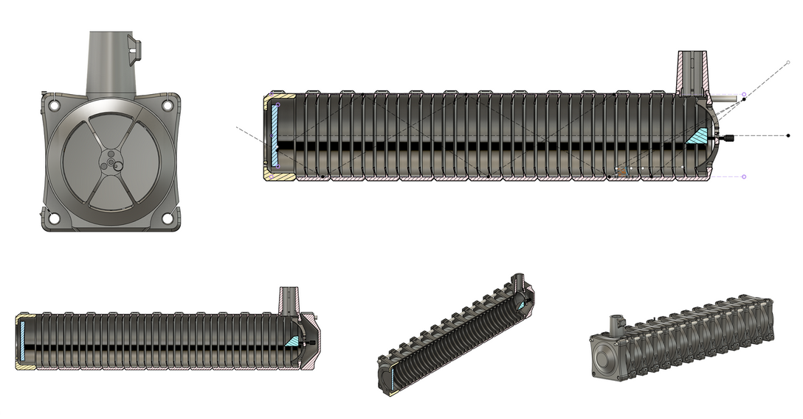
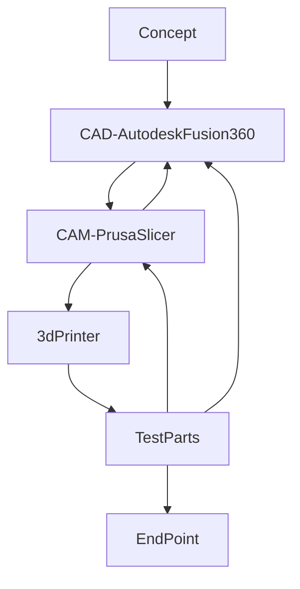

# Telescope
A 3d printed newtonian telescope I designed and built as a personal project. 
Some quick highlights: 
-	the unit features baffling down the optical tube assembly
-	can be printed in the volume of a Prusa MK3S or similarly sized printer
-	is modular in construction allowing for disassembly

## Design
Autodesk Fusion 360 was used as the CAD[^1] tool and Prusa Slicer served as the CAM[^2] tool in the development process. The design was started with 2D high level sketching exploring mirror, lens, and ray paths to drive posistioning of the key parts. Once this phase was completed the structure was iterated on. The slicer acted as a feedback mechanism allowing for the design to be adjusted not only for use, and assembly, but also for ease of printing. Ease of printing in this sense meaning optimizing the filament use of each section so that there is no need to swap out rolls during printing (if starting with a full roll) and that the supports would be easy to remove. It can be noted that depending on a shape a support can take a non-trivial time to remove, and that its removal could also result in damaging the print. Optical components (mirrors, lenses, and mounts) were sourced from Amazon while raw material & hardware from McMaster-Carr. A simple BoM[^3] can be found in the [models\README.md](models\README.md).

Flow chart of the Design Process:

### Baffles
Each cross section is printed with ridges/fingers/ribs. These are baffles and they act to trap stray light rays or reduce the energy in the stray light ray by bouncing it around some before it gets to a person’s eye or a camera / imager. You can see some rough sketches that were turned on where ray tracing was done manually to find a good enough configuration in the below image. 

These rays could come from artificial light sources and other sources that might impact image quality. Telescope builds in this size class are typically done with plain cardboard tubes which are then coated with a matte black paint. The approach lowers the amount of reflected energy, but depending on the ray incident with the tube wall light may only have one or two bounces. Since this was 3D printed, I had the ability to go beyond a plain tube and add additional complexity in the form of baffling. These baffles function to trap rays giving them 2 or more bounces before leaving the baffle reducing ray energy. Ideally these baffles would also be coated with a low reflective paint for added performance. If one were to fully optimize the baffles these features would change spacing and geometry (curve profile) through the length of the tube assembly [^4]. However, to keep the part variation low, all tube cross sections (except for the front and rear) are the same. As I am located in a urban area baffleing can mitigate nearish light sources such as street lights, flashlights, illumination from mobile devices, and automotive sources. 

### Printing
The parts are printed with less supports that normally seen due to tweaks in geometry. Supports were manually added in a few spots. The telescope was constrained in size by what I could fit standing up on the printer. All sections (except for the eye piece are a single print). The eye piece end is printed in two parts and bonded together.  Removing the tube and having it glued in allowed for build test and design iterations that did not need to wait on an 18 hr print, also reduced filament consumption, and allowed for test prints in between the batch prints of the other sections. The tube which holds the eye piece required some iterations to get the right amount of friction in the adjustment for the eye piece. 
Very low gyroid infills were used and supports were manually added to improve support removal and print time. 

## Disassembly & Reassembly 
One of the driving goals of the modularity was to allow the unit to be broken down to fit with in the standard airline checked luggage size limit (with the optics being carry on). The closest darksies with minimal treecover are all west of the Mississippi River[^5]. Theses sites would necessitate a long road trip or flying. 

For assembly and dissassembly time not all locations for fastners were utilized. It was found that the pockets for the nuts were a bit thin. Switching to non nylocs or thicker walls in these regions would remedy this. 

## Using the Telescope
### First Light
Some of the 1st images captured with a cell phone and camera mount. More work can be done to improve this such as getting an imager board and more ridigly mounting a camera to the scope. Currently taking photos of stars is not possible. The picture of jupiter is a near best case of these results using a smart phone camera. The COTS phone mount I found is not good enough for sufficently large cell phones. A fair bit of detail can be seen with the eye including a few of the moons of jupiter. The below photos were taken in suburban metro Atlanta, GA. 

| Jupiter | Moon 1 | Moon 2 |
| :---: | :---: | :---: |
|  |  |  |

At present the unit does not have a finder scope to aim to help with aiming. The inward curved sides can be used with some success to aim at targets. This along with the cell phone mounting is a current short coming of the system. A finder scope may be added in the future. The rails running along each corner were exposed in the design to allow for adding attachments. The adapter to attach to a tripod was connected to the telescope with the rails. 

### Camping Trip
I was able to do a camping trip out to Camanche National Grasslands[^6] as part of road trip to Denver for a trade show. A number of sites in the grasslands feature very dark skies and minimal tree or tall terrain features providing a near unobstructed full 360 degree view of the sky in some of the darkest areas of the continental United States. No photos from the scope exist due to issues with the COTS phone mount. 

| Deploying System | Image of Sky | Telescope Setup @ Night |
| :---: | :---: | :---: |
|  |  |  |

[^1]: CAD = Computer Aided Design 
[^2]: CAM = Computer Aided Machining / Manufacturing
[^3]: BoM = Bill of Materials
[^4]: [MERTIS - Reflective baffle design and manufacturing](https://www.nicoform.com/Images_Content/Site1/Files/Articles/MERTISReflectiveBaffleDesign.pdf)
[^5]: [Dark Sky Map](https://www.darkskymap.com/)
[^6]: [Comanche National Grasslands](https://www.fs.usda.gov/recarea/psicc/recarea/?recid=12409)

