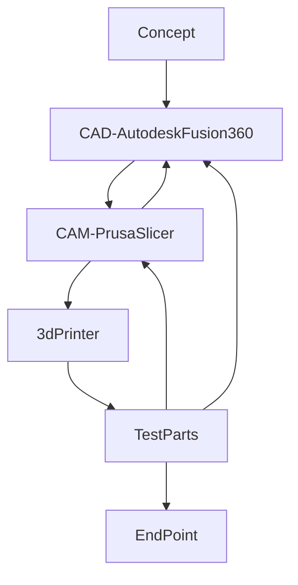

# Telescope
A 3d printed newtonian telescope I designed and built as a personal project. 
Some quick highlights: 
-	the unit features baffling down the optical tube assembly
-	can be printed in the volume of a Prusa MK3S or similarly sized printer
-	is modular in construction allowing for disassembly

## Design
Autodesk Fusion 360 and Prusa Slicer were used in the design. The slicer acted as a feedback mechanism allowing for the design to be adjusted for not only for use, and assembly, but also for ease of printing. Ease of printing in this sense means optimizing the filament of each section so that there is no need to swap out rolls during printing (if starting with a full roll) and that the supports would be easy to remove. It can be noted that depending on a shape a support can take a non-trivial time to remove, and that its removal could also result in damaging the print. Optical components (mirrors, lenses, and mounts) were sourced from Amazon while raw material & hardware from McMaster-Carr. 

Flow chart of the Design Process:

### Baffles
Each cross section is printed with ridges/fingers/ribs. These are baffles and they act to trap stray light rays or reduce the energy in the stray light ray by bouncing it around some before it gets to a person’s eye or a camera / imager. You can see some rough sketches that were turned on where ray tracing was done manually to find a good enough configuration. These rays could come from artificial light sources and other sources that might impact image quality. Telescope builds in this size class are typically done with plain cardboard tubes which are then coated with a matte black paint. The approach lowers the amount of reflected energy, but depending on the ray incident with the tube wall light may only have one or two bounces. Since this was 3D printed, I had the ability to go beyond a plain tube and add additional complexity in the form of baffling. These baffles function to trap rays giving them 2 or more bounces before leaving the baffle reducing ray energy. Ideally these baffles would also be coated with a low reflective paint for added performance. If one were to fully optimize the baffles these features would change spacing and geometry (curve profile) through the length of the tube assembly. However, to keep the part variation low all tube cross sections except for the front and rear are the same.  

### Printing
The parts are printed with less supports that normally seen due to tweaks in geometry. Supports were manually added in a few spots. The telescope was constrained in size by what I could fit standing up on the printer. All sections (except for the eye piece are a single print). The eye piece end is printed in two parts and bonded together.  Removing the tube and having it glued in allowed for build test and design iterations that did not need to wait on an 18 hr print, also reduced filament consumption, and allowed for test prints in between the batch prints of the other sections. The tube which holds the eye piece required some iterations to get the right amount of friction in the adjustment for the eye piece. 
Very low gyroid infills were used and supports were manually added to improve support removal and print time. 

## Disassembly & Reassembly

## Use
### First Light

### Camping Trip
