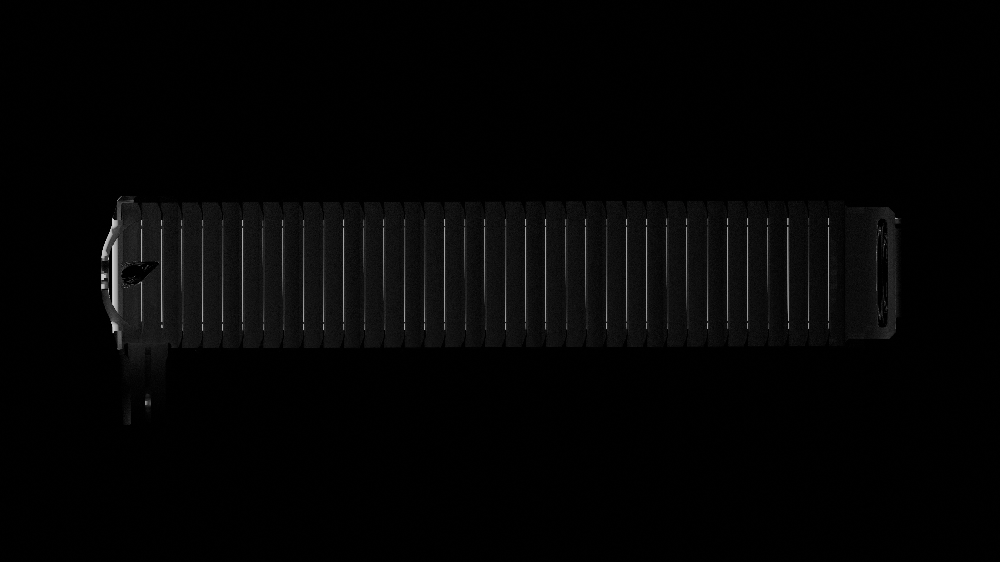
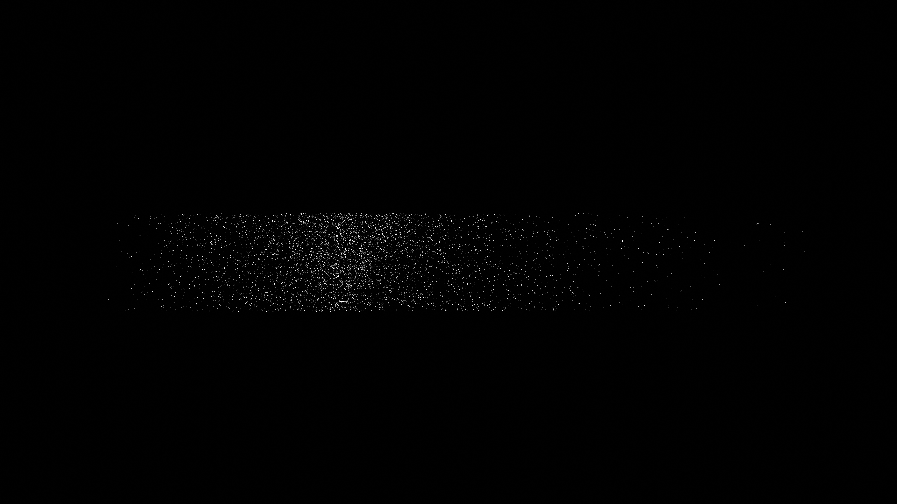
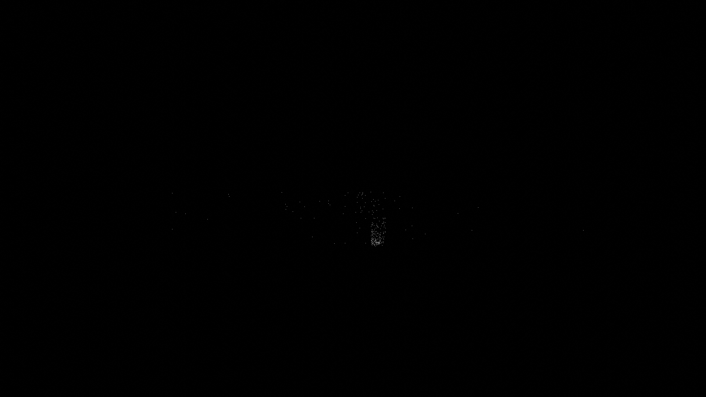
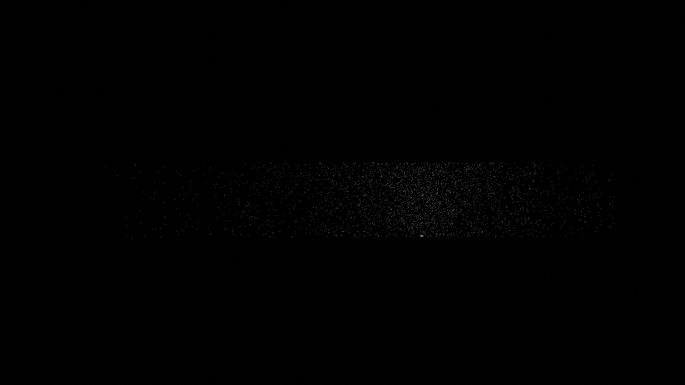
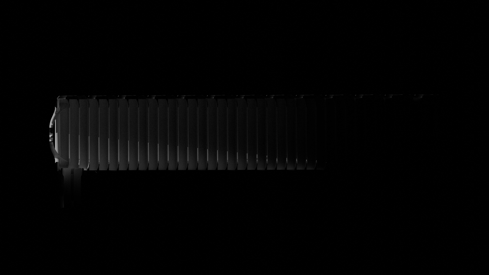
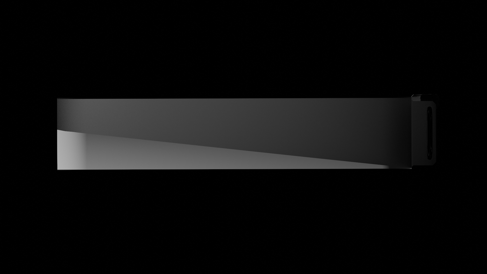
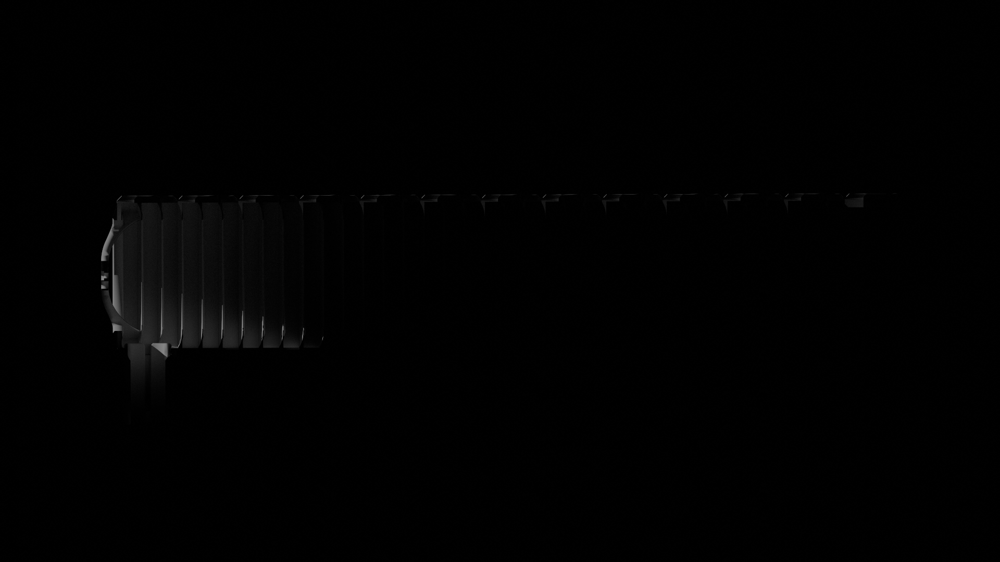
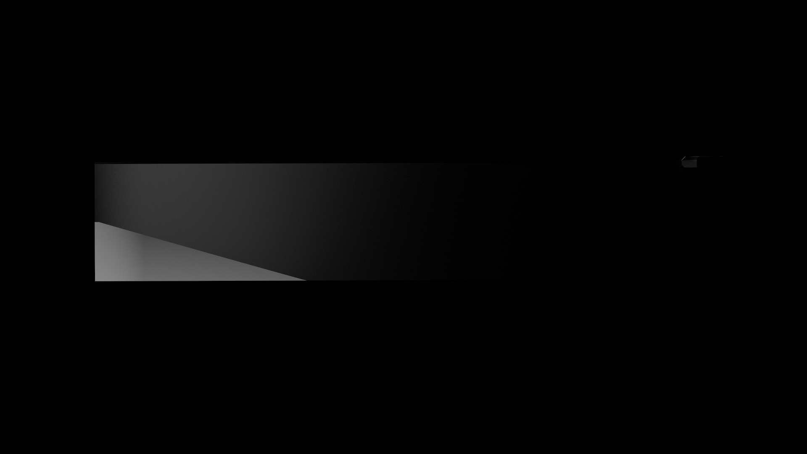

As mentioned in the overview the baffle design was done with manual geometric ray tracing in the top level sketches. The overall approach was inspire by the MERTIS paper (ref is in the primary README). There are limitations to the manual approach, but how good or good enough is it? 

While opensource ray tracing and optics design tools are not as well polished as commercial tools such as tracepro and zemax, there are options to look at the baffle design with ray tracing found in opensource rendering software. This approach can give us a comparison, but cannot give us exact info such as an easy way to observe the path of rays, energy in the rays, or a route to numerically compare the results. A qualitative and some what subjective approach can be attempted with tools such as Blender[^1] and LuxCoreRender[^2]. 

Blender 4.2 and BlendLuxCore 2.9 were used on windows to conduct this comparison. The render time was fixed and plain tube was swapped out the baffle sections. Material properties with a matte finish and lighting setup was kept the same so that the only variable in each is the geometry. The secondary mirror was also turned off.

| Setup | Baffle | Plain |
| :---: | :---: | :---: |
| Offset Laser Front |  |  |
| Offset Laser Rear | |  |
| Offset Point Near|  |  |
| Offset Point Far|  |  |

Looking at the two laser setups we can see that the baffles do appear to be trapping reflections as generally intended compared to the tube. For the offset point sources we can also observe that the baffled tube seems to be greatly reducing the light energy that gets down toward the primary mirror compared to the plain tube. Thus reducing stray light rays getting to the eye piece. One area of improvement can be somewhat observed in the offset point renderings. A hood, shade, shroud mounted to the front posts during use may reduce rays in the eyepiece tube area some. This front region is where the storage cover sits when the telescope is not being used so there is space to experiment.

The approach while somewhat helpful has limitations and cannot readily answer more in-depth questions such as:
1. How beneficial would adding a matte coating to the baffle be?
2. What trade offs would different coatings present?
3. Could the baffle benefit from simple geometric adjustments? 
4. When light does make it the eyepiece how much energy does it have?

The 4th question has some relevance, if we were to put an imager at the eyepiece knowing something about the energy of stray rays might help us understand if that energy gets lost in the noise of the imager or if it is comparable to stars. However most of the imagers in the DIY / hobbyist realm aren't necessarily going to have exceptional low light performance and the population to select from isn't as varied.  

Other tools such as ray-optics[^3] and possibly solvers for openFOAM[^4] such as laserbeamFOAM may also present a way to investigate the baffled tube further.

[^1]: [Blender](https://www.blender.org)
[^2]: [LuxCoreRender](https://luxcorerender.org/)
[^3]: [ray-optics](https://github.com/mjhoptics/ray-optics)
[^4]: [openFOAM](https://openfoam.org/)
